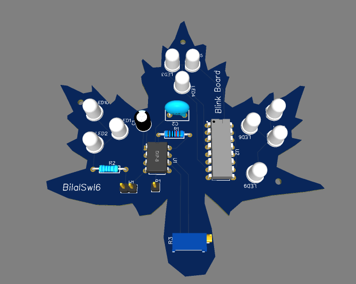
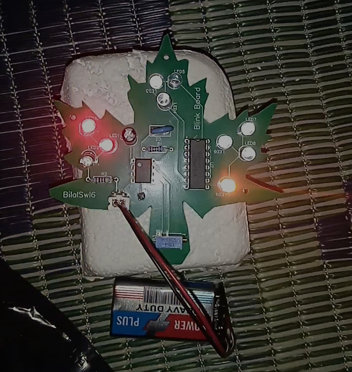

# Blink-Board
A board with LEDs that light in sequence and make patterns

I just follow guide guide in [blueprint](https://blueprint.hackclub.com/starter-projects/blinky). 

## What i learnt:
- IC (integrated circuts)
- How to use Easyeda
- how to design dxf file and import in easyeda
- Layer in PCBs
- Why Pad is used in PCB
- And lot more....

here is a screenshot of 3D File

